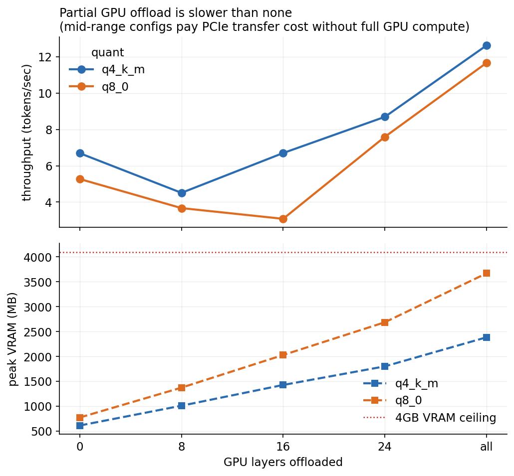

# Doctrine-RAG

Quantifying the quality/latency/memory tradeoff of running a full RAG pipeline on a consumer GPU.

I built a retrieval-augmented generation system over a US Army Field Manual (FM 5-0) and benchmarked it end to end on a 4GB GTX 1050. Hybrid retrieval, a quantized local generator, an independent LLM judge for quality scoring, and statistical testing on every result.




## Why

I built this to find out what a full RAG pipeline actually costs in answer quality on cheap hardware, and where it starts breaking down. Everything below is measured on a 4GB GTX 1050.

Three findings, which are supported by by confidence intervals and significance tests in the writeup:

- **Hybrid retrieval wins.** BM25 + dense embeddings combined via reciprocal rank fusion beats either one alone. The two methods respond in opposite directions to adversarially-phrased (false-premise) questions.
- **Half-offloading a model to the GPU is slower than not offloading at all.** Throughput dips in the middle of the offload range before it recovers, because you're paying PCIe transfer costs without enough GPU compute to make up for it. So, on weak hardware ->  offload everything or nothing.
- **8-bit quantization beats 4-bit on faithfulness and citation accuracy.** The correctness gain is only borderline, and it costs 54% more VRAM with no speed upside. On a 4GB card, 4-bit is the better default.

## Try it yourself

Chat with the system directly in your terminal. It retrieves real paragraphs from the manual and streams the generated answer live:

```bash
python -m src.generate.chat --show-context
```

```
you > What is the RDSP?

  retrieved:
    [FM 5-0 1-60] The RDSP is a planning methodology that commanders...
    [FM 5-0 6-14] The RDSP is a technique that commanders and their staffs...

doctrine-rag > The RDSP (Rapid Decision-making and Synchronization Process)
is a technique commanders and staffs use during execution to make rapid,
timely decisions in response to changing conditions... [FM 5-0, para 6-15]
```

`/context` toggles whether you see the retrieved paragraphs, `/k N` changes how many get retrieved, `/quit` exits.

## Bringing It All Together

```
PDF (FM 5-0)
  │  paragraph-aware parser
  ▼
1,043 doctrine paragraphs ──┬── BM25 index
                             └── BGE-small embeddings → FAISS index
                                        │
                                  hybrid retriever (RRF)
                                        │
299 verified Q&A ──────────────────────┤
(generated + screened +                │
 human-verified)                       ▼
                              quantized generator (Qwen2.5-3B, GGUF)
                              on GTX 1050: Q4/Q8 × offload sweep
                                        │
                              Claude judge (independent, cross-family)
                                        │
                          bootstrap CIs · paired tests · reliability check
                                        │
                                     figures + writeup
```

## What's in the repo

```
config/config.yaml       all paths, models, and experiment parameters
data/
  raw_pdfs/               source FM PDFs (not tracked)
  parsed/                 parsed paragraph JSONL
  eval/                   generated + verified Q&A sets
  index/                  FAISS + BM25 indexes, embeddings (not tracked, regenerable)
src/
  parse/                  PDF → paragraph-aware chunks
  index/                  embedding + FAISS/BM25 index building
  retrieve/               hybrid retriever (BM25 + dense + RRF)
  eval/                   eval-set generation, screening, retrieval metrics,
                          Claude judge, statistics, judge reliability
  generate/                GGUF download, local LLM wrapper, RAG prompt,
                          benchmark harness, interactive chat
  viz/                    figure generation
results/
  tables/                 all metric CSVs and statistics.json
  figures/                the four headline PNGs
writeup/paper.md          full mini-paper
```

## Running it yourself

Needs Python 3.11, a CUDA-capable GPU (I used a 4GB GTX 1050) with `llama-cpp-python` built for CUDA, and an Anthropic API key for eval-set generation and judging.

```bash
pip install -r requirements.txt

# 1. Parse a Field Manual PDF into paragraphs
python -m src.parse.fm_parser data/raw_pdfs/FM_5-0.pdf data/parsed/fm5-0.jsonl --fm-id "FM 5-0"

# 2. Embed + build indexes
python -m src.index.embed
python -m src.index.build_faiss

# 3. Try retrieval
python -m src.retrieve.retriever "What is the RDSP?" --top-k 5

# 4. (optional) Generate + verify a new eval set
export ANTHROPIC_API_KEY=sk-ant-...
python -m src.eval.build_eval_set --n 150
python -m src.eval.screen_eval_set --split vanilla

# 5. Retrieval metrics
python -m src.eval.retrieval_metrics

# 6. Download quantized models and benchmark (run ON the target GPU)
python -m src.generate.download_gguf --quant q4_k_m q8_0
python -m src.generate.benchmark --quant q4_k_m q8_0 --layers 0 8 16 24 -1 --n-questions 150

# 7. Judge quality + run statistics
python -m src.eval.judge --all-configs
python -m src.eval.stats
python -m src.eval.judge_reliability --n 100

# 8. Generate figures
python -m src.viz.plots

# 9. Chat with it
python -m src.generate.chat --show-context
```

Corpus parsing, embedding, and judging can run anywhere, a cloud GPU or plain CPU is fine for those. Step 6, the benchmark, has to run on the actual target GPU. That measurement only means something if it's real hardware.

## Results at a glance

| | |
|---|---|
| Corpus | FM 5-0, 1,043 paragraphs |
| Eval set | 299 human-verified Q&A (150 vanilla + 149 negative) |
| Best retrieval | Hybrid: R@5 = 0.967, MRR = 0.844 |
| Generator | Qwen2.5-3B-Instruct, GGUF (Q4_K_M / Q8_0) |
| Hardware | NVIDIA GTX 1050, 4GB VRAM |
| Best throughput | 12.6 tok/s (Q4, full offload) |
| Peak VRAM | 3670 MB / 4096 MB (Q8, full offload) |
| Judge reliability | quadratic-weighted κ ≈ 0.98 |

Full tables and statistical tests live in [`results/tables/`](results/tables/). Full discussion is in [`writeup/paper.md`](writeup/paper.md).

## Licenses

FM 5-0 is a public US Army publication (Army Publishing Directorate). Qwen2.5-3B-Instruct is Apache-2.0. BGE-small-en-v1.5 is MIT. This is an independent technical project and isn't affiliated with or endorsed by the US Army.
